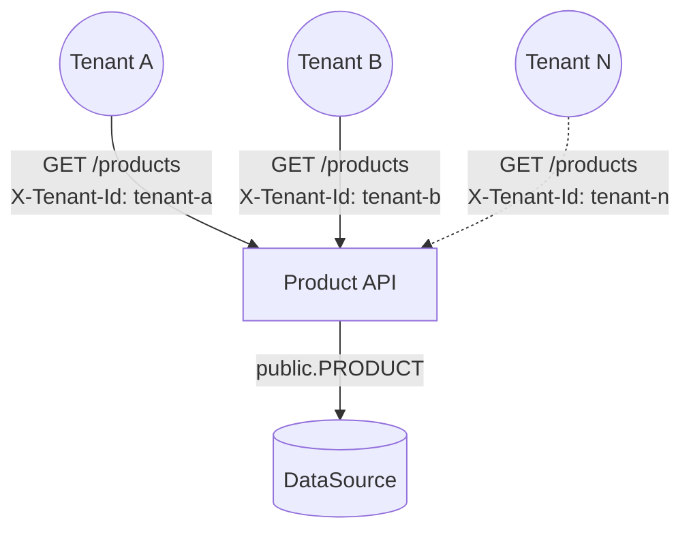
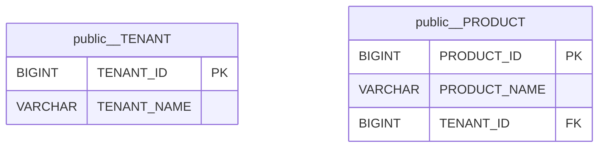

# POC: Multi-tenancy Shared Schemas

It demonstrates how to implement a multi-tenant REST API that persists data in the same table.

The goal is to develop a REST API capable of persist and retrieve a product catalog. Each product must have a name and a
unique ID generated automatically by a database sequence that is going to be assigned to the product when the client
requests a new product to be created.

The application should be able to receive the tenant name from the client via HTTP header and provide the tenant
associated with that name to lower-level APIs that deals with logic related to persistence. Every database table record
should contain a reference to which tenant that data relates to, every entity should be associated with a Tenant object
and all database queries should be tenant-oriented, which means queries without a result set should provide the tenant
identifier as a value for a column and queries that return a result set should contain a where clause filtering the
results for a single tenant. An error should be returned to clients requesting data
without informing a known tenant.

All tenant configuration should be defined outside the application source code using property files, and we must be able
to add or remove tenants without changing the source code.

The Web service is implemented using Spring MVC, data is persisted on Postgres databases managed by Flyway using
Spring Data JPA. The source code is managed by JUnit with databases provisioned in containers managed by TestContainers
and no manual configuration is required to run automated tests.

## How to run

| Description                    | Command                                             |
|:-------------------------------|:----------------------------------------------------|
| Run tests                      | `./gradlew test`                                    |
| Run application                | `./gradlew bootRun`                                 |
| Provision database¹            | `docker-compose up --detach`                        |
| Destroy database¹              | `docker-compose down --volumes`                     |

> ¹Required for manual testing only, automated tests provision and destroy a database automatically. Must run
> inside `infrastructure` folder.

## Preview

Overview of this multi-tenant approach:



Database structure for the DataSource:



> Symbol `__` means `.`, so `public__PRODUCT` means `public.PRODUCT`.

Logging statements from application startup during automated tests:

```text
2022-07-30T17:24:34.960-03:00 DEBUG 88610 --- [    Test worker] c.e.internal.TenantsContextInitializer   : Initializing tenants context
2022-07-30T17:24:34.964-03:00  INFO 88610 --- [    Test worker] com.example.ApplicationTest              : Starting ApplicationTest using Java 18.0.2 on pc with PID 88610
2022-07-30T17:24:34.964-03:00 DEBUG 88610 --- [    Test worker] com.example.ApplicationTest              : Running with Spring Boot v3.0.0-M4, Spring v6.0.0-M5
2022-07-30T17:24:34.964-03:00  INFO 88610 --- [    Test worker] com.example.ApplicationTest              : No active profile set, falling back to 1 default profile: "default"
2022-07-30T17:24:35.303-03:00  INFO 88610 --- [    Test worker] .s.d.r.c.RepositoryConfigurationDelegate : Bootstrapping Spring Data JPA repositories in DEFAULT mode.
2022-07-30T17:24:35.371-03:00  INFO 88610 --- [    Test worker] .s.d.r.c.RepositoryConfigurationDelegate : Finished Spring Data repository scanning in 62 ms. Found 2 JPA repository interfaces.
2022-07-30T17:24:35.693-03:00  INFO 88610 --- [    Test worker] o.s.b.w.embedded.tomcat.TomcatWebServer  : Tomcat initialized with port(s): 0 (http)
2022-07-30T17:24:35.700-03:00  INFO 88610 --- [    Test worker] o.apache.catalina.core.StandardService   : Starting service [Tomcat]
2022-07-30T17:24:35.700-03:00  INFO 88610 --- [    Test worker] org.apache.catalina.core.StandardEngine  : Starting Servlet engine: [Apache Tomcat/10.0.22]
2022-07-30T17:24:35.766-03:00  INFO 88610 --- [    Test worker] o.a.c.c.C.[Tomcat].[localhost].[/]       : Initializing Spring embedded WebApplicationContext
2022-07-30T17:24:35.767-03:00  INFO 88610 --- [    Test worker] w.s.c.ServletWebServerApplicationContext : Root WebApplicationContext: initialization completed in 792 ms
2022-07-30T17:24:35.848-03:00  INFO 88610 --- [    Test worker] o.f.c.internal.license.VersionPrinter    : Flyway Community Edition 9.0.1 by Redgate
2022-07-30T17:24:35.848-03:00  INFO 88610 --- [    Test worker] o.f.c.internal.license.VersionPrinter    : See what's new here: https://flywaydb.org/documentation/learnmore/releaseNotes#9.0.1
2022-07-30T17:24:35.848-03:00  INFO 88610 --- [    Test worker] o.f.c.internal.license.VersionPrinter    : 
2022-07-30T17:24:35.852-03:00  INFO 88610 --- [    Test worker] com.zaxxer.hikari.HikariDataSource       : HikariPool-1 - Starting...
2022-07-30T17:24:35.945-03:00  INFO 88610 --- [    Test worker] com.zaxxer.hikari.pool.HikariPool        : HikariPool-1 - Added connection org.postgresql.jdbc.PgConnection@3d9c8c3c
2022-07-30T17:24:35.946-03:00  INFO 88610 --- [    Test worker] com.zaxxer.hikari.HikariDataSource       : HikariPool-1 - Start completed.
2022-07-30T17:24:35.960-03:00  INFO 88610 --- [    Test worker] o.f.c.i.database.base.BaseDatabaseType   : Database: jdbc:postgresql://localhost:49308/test (PostgreSQL 14.4)
2022-07-30T17:24:35.980-03:00  INFO 88610 --- [    Test worker] o.f.core.internal.command.DbValidate     : Successfully validated 3 migrations (execution time 00:00.010s)
2022-07-30T17:24:35.987-03:00  INFO 88610 --- [    Test worker] o.f.c.i.s.JdbcTableSchemaHistory         : Creating Schema History table "public"."flyway_schema_history" ...
2022-07-30T17:24:36.010-03:00  INFO 88610 --- [    Test worker] o.f.core.internal.command.DbMigrate      : Current version of schema "public": << Empty Schema >>
2022-07-30T17:24:36.014-03:00  INFO 88610 --- [    Test worker] o.f.core.internal.command.DbMigrate      : Migrating schema "public" to version "1 - create tenant table"
2022-07-30T17:24:36.024-03:00  INFO 88610 --- [    Test worker] o.f.core.internal.command.DbMigrate      : Migrating schema "public" to version "2 - create product table"
2022-07-30T17:24:36.030-03:00  INFO 88610 --- [    Test worker] o.f.core.internal.command.DbMigrate      : Migrating schema "public" to version "3 - insert tenants"
2022-07-30T17:24:36.034-03:00  INFO 88610 --- [    Test worker] o.f.core.internal.command.DbMigrate      : Successfully applied 3 migrations to schema "public", now at version v3 (execution time 00:00.026s)
2022-07-30T17:24:36.079-03:00  INFO 88610 --- [    Test worker] o.hibernate.jpa.internal.util.LogHelper  : HHH000204: Processing PersistenceUnitInfo [name: default]
2022-07-30T17:24:36.102-03:00  INFO 88610 --- [    Test worker] org.hibernate.Version                    : HHH000412: Hibernate ORM core version 6.1.1.Final
2022-07-30T17:24:36.186-03:00  WARN 88610 --- [    Test worker] org.hibernate.orm.deprecation            : HHH90000021: Encountered deprecated setting [javax.persistence.sharedCache.mode], use [jakarta.persistence.sharedCache.mode] instead
2022-07-30T17:24:36.252-03:00  INFO 88610 --- [    Test worker] SQL dialect                              : HHH000400: Using dialect: org.hibernate.dialect.PostgreSQLDialect
2022-07-30T17:24:36.579-03:00  INFO 88610 --- [    Test worker] o.h.e.t.j.p.i.JtaPlatformInitiator       : HHH000490: Using JtaPlatform implementation: [org.hibernate.engine.transaction.jta.platform.internal.NoJtaPlatform]
2022-07-30T17:24:36.583-03:00  INFO 88610 --- [    Test worker] j.LocalContainerEntityManagerFactoryBean : Initialized JPA EntityManagerFactory for persistence unit 'default'
2022-07-30T17:24:36.756-03:00 DEBUG 88610 --- [    Test worker] c.e.internal.TenantsContextInitializer   : Registering tenants bean (tenants=[Tenant(id=2, name=company-b), Tenant(id=1, name=company-a)])
2022-07-30T17:24:36.844-03:00  WARN 88610 --- [    Test worker] JpaBaseConfiguration$JpaWebConfiguration : spring.jpa.open-in-view is enabled by default. Therefore, database queries may be performed during view rendering. Explicitly configure spring.jpa.open-in-view to disable this warning
2022-07-30T17:24:37.030-03:00  INFO 88610 --- [    Test worker] o.s.b.w.embedded.tomcat.TomcatWebServer  : Tomcat started on port(s): 35223 (http) with context path ''
2022-07-30T17:24:37.035-03:00  INFO 88610 --- [    Test worker] com.example.ApplicationTest              : Started ApplicationTest in 2.204 seconds (process running for 5.142)
2022-07-30T17:24:37.385-03:00  INFO 88610 --- [o-auto-1-exec-1] o.a.c.c.C.[Tomcat].[localhost].[/]       : Initializing Spring DispatcherServlet 'dispatcherServlet'
2022-07-30T17:24:37.386-03:00  INFO 88610 --- [o-auto-1-exec-1] o.s.web.servlet.DispatcherServlet        : Initializing Servlet 'dispatcherServlet'
2022-07-30T17:24:37.386-03:00  INFO 88610 --- [o-auto-1-exec-1] o.s.web.servlet.DispatcherServlet        : Completed initialization in 0 ms
2022-07-30T17:24:37.392-03:00 DEBUG 88610 --- [o-auto-1-exec-1] com.example.internal.TenantInterceptor   : Handling request for tenant Tenant(id=1, name=company-a)
2022-07-30T17:24:37.434-03:00  INFO 88610 --- [o-auto-1-exec-1] c.example.product.api.ProductController  : Creating new product (tenant=Tenant(id=1, name=company-a), request=ProductRequest(name=A4 Paper))
2022-07-30T17:24:37.456-03:00  INFO 88610 --- [o-auto-1-exec-1] c.example.product.api.ProductController  : New product created (product=Product(id=1, name=A4 Paper, tenant=Tenant(id=1, name=company-a)))
2022-07-30T17:24:37.461-03:00 DEBUG 88610 --- [o-auto-1-exec-1] com.example.internal.TenantInterceptor   : Removed tenant assigned previously before sending response to client
2022-07-30T17:24:37.480-03:00 DEBUG 88610 --- [o-auto-1-exec-2] com.example.internal.TenantInterceptor   : Handling request for tenant Tenant(id=1, name=company-a)
2022-07-30T17:24:37.481-03:00  INFO 88610 --- [o-auto-1-exec-2] c.example.product.api.ProductController  : Creating new product (tenant=Tenant(id=1, name=company-a), request=ProductRequest(name=Pencil 1B))
2022-07-30T17:24:37.483-03:00  INFO 88610 --- [o-auto-1-exec-2] c.example.product.api.ProductController  : New product created (product=Product(id=2, name=Pencil 1B, tenant=Tenant(id=1, name=company-a)))
2022-07-30T17:24:37.483-03:00 DEBUG 88610 --- [o-auto-1-exec-2] com.example.internal.TenantInterceptor   : Removed tenant assigned previously before sending response to client
2022-07-30T17:24:37.494-03:00 DEBUG 88610 --- [o-auto-1-exec-3] com.example.internal.TenantInterceptor   : Handling request for tenant Tenant(id=2, name=company-b)
2022-07-30T17:24:37.495-03:00  INFO 88610 --- [o-auto-1-exec-3] c.example.product.api.ProductController  : Creating new product (tenant=Tenant(id=2, name=company-b), request=ProductRequest(name=Eraser))
2022-07-30T17:24:37.497-03:00  INFO 88610 --- [o-auto-1-exec-3] c.example.product.api.ProductController  : New product created (product=Product(id=3, name=Eraser, tenant=Tenant(id=2, name=company-b)))
2022-07-30T17:24:37.498-03:00 DEBUG 88610 --- [o-auto-1-exec-3] com.example.internal.TenantInterceptor   : Removed tenant assigned previously before sending response to client
2022-07-30T17:24:37.504-03:00 DEBUG 88610 --- [o-auto-1-exec-4] com.example.internal.TenantInterceptor   : Handling request for tenant Tenant(id=1, name=company-a)
2022-07-30T17:24:37.504-03:00  INFO 88610 --- [o-auto-1-exec-4] c.example.product.api.ProductController  : Finding all existing products (tenant=Tenant(id=1, name=company-a))
2022-07-30T17:24:37.521-03:00  INFO 88610 --- [o-auto-1-exec-4] c.example.product.api.ProductController  : Returning all products found (products=ProductsResponse(products=[ProductResponse(id=1, name=A4 Paper), ProductResponse(id=2, name=Pencil 1B)]))
2022-07-30T17:24:37.528-03:00 DEBUG 88610 --- [o-auto-1-exec-4] com.example.internal.TenantInterceptor   : Removed tenant assigned previously before sending response to client
2022-07-30T17:24:37.547-03:00 DEBUG 88610 --- [o-auto-1-exec-5] com.example.internal.TenantInterceptor   : Handling request for tenant Tenant(id=2, name=company-b)
2022-07-30T17:24:37.547-03:00  INFO 88610 --- [o-auto-1-exec-5] c.example.product.api.ProductController  : Finding all existing products (tenant=Tenant(id=2, name=company-b))
2022-07-30T17:24:37.550-03:00  INFO 88610 --- [o-auto-1-exec-5] c.example.product.api.ProductController  : Returning all products found (products=ProductsResponse(products=[ProductResponse(id=3, name=Eraser)]))
2022-07-30T17:24:37.551-03:00 DEBUG 88610 --- [o-auto-1-exec-5] com.example.internal.TenantInterceptor   : Removed tenant assigned previously before sending response to client
```